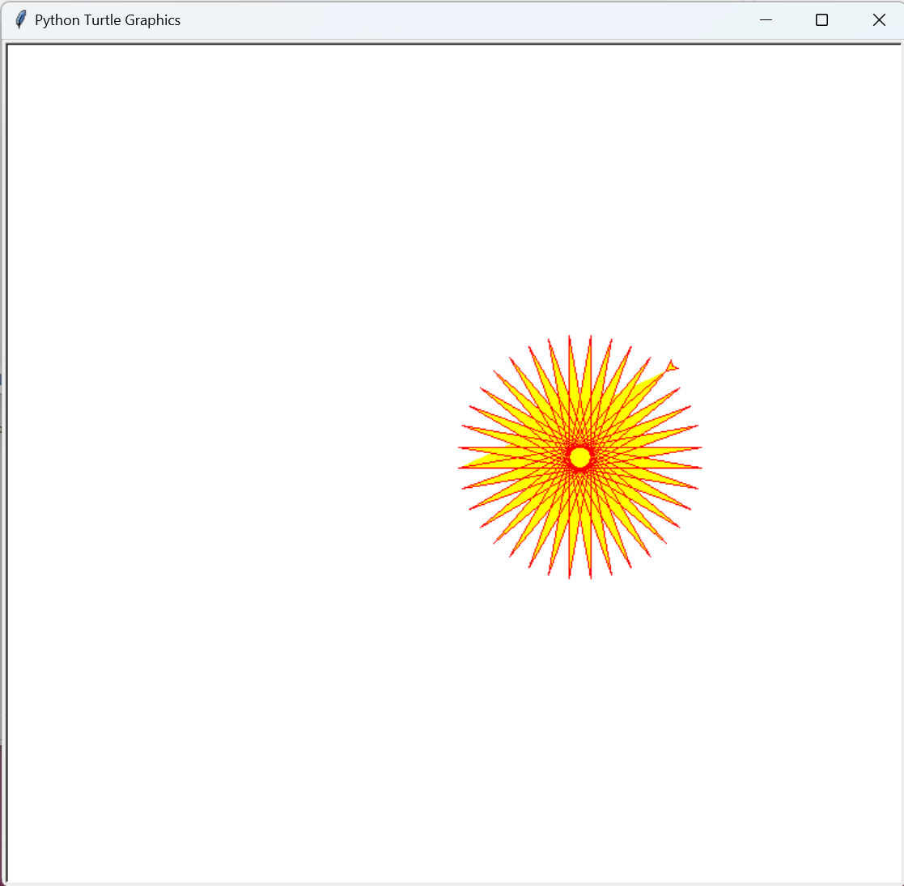

<h1 align="center" name="binpython">BINPython</h1>

    <em>Lightweight and small portable Python, build with pyinstaller
</em>

# What is BINPython?
BINPython is a single-file, green version of Python that supports encapsulation of custom libraries and can be integrated into programs/projects 
# Why BINPython
* no edit to registry  
* no extra .dlls（only a single executable）  
* licensed with AGPL-V3.0  
* Easy to integrate into any program, allowing any .py file to run without compiling to an executable  
* Built-in portable IDE environment, you can enjoy the highlighted standardized IDE without downloading additional IDE 
* Built-in portable http server for fast file transfer 
* Built-in tkinter and turtle GUI form application framework to quickly build compile-free form applications 
* Built-in dynamic website running framework such as tornado pywebio, the server is carried with you 
* Support to encapsulate any library into BINPython, take it with you wherever you go 
* The program occupies a small storage space 

# How to use?
## On Windows
Double click to enter BINPython Shell 

Enter CMD, switch to the current BINPython working directory (use cd, etc.), and then enter `binpython -h` in cmd to see the usage
## On Linux
By `cd` to the BINPython working environment, using `binpython` will open the BINPython shell. View the usage of BINPython through `binpython -h`
# Run the .py file
Just use `binpython <filename.py>` or `binpython -f <filename.py>(--file=<filename.py>)`
# Github repository
[Github](https://github.com/xingyujie/binpython)
# Github releases
[Releases](https://github.com/xingyujie/binpython/releases)
# Screenshot
The following screenshot libraries have been built into the standard releases version, of course, there are many libraries without screenshots, please experience it yourself
## BINPython Shell

## Run Turtle via BINPython

## Run Tornado web server via BINPython

## Run tkinter via BINPython

#### . . . There are a lot more. Because you can wrap any library into BINPython