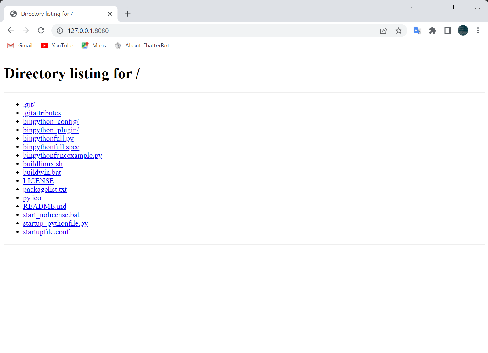

BINPython has a built-in file transfer server, you can transfer code or arbitrary files to other computers anywhere. Start the server with `binpython -s <port>(--server=<port>)`, where `<port>` is an arbitrary and unoccupied port number
# Screenshot
