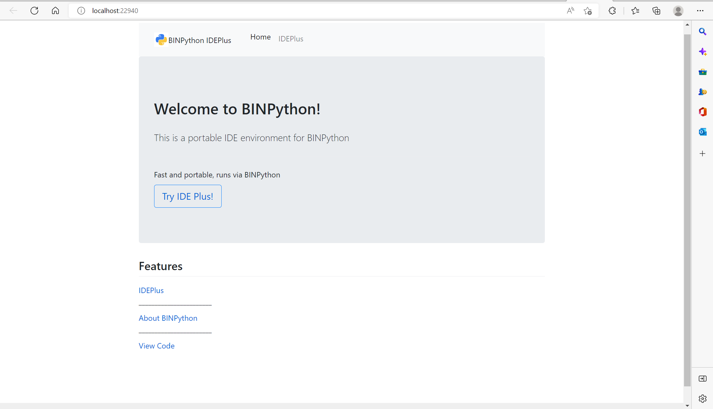
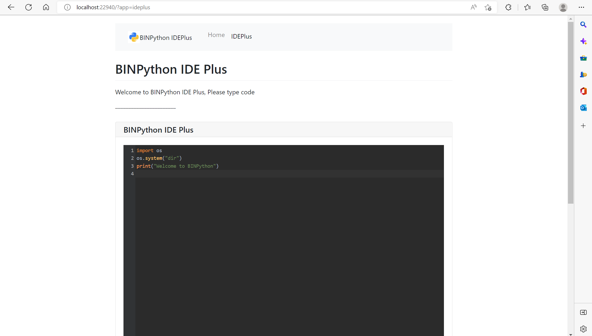
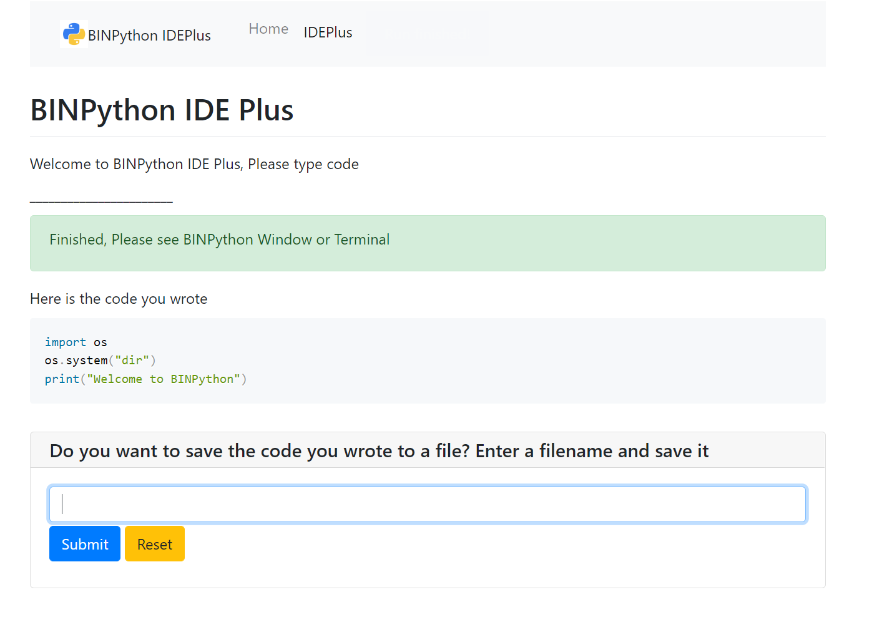
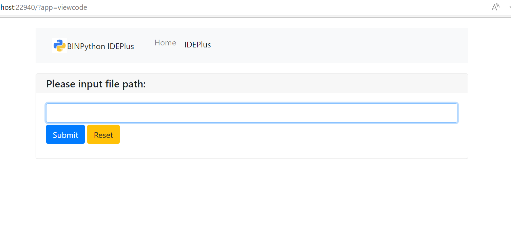
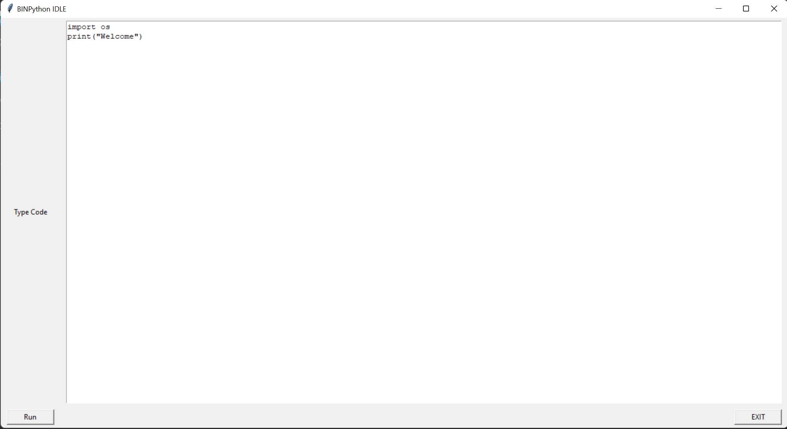

# BINPython IDE
Yes, a set of fast, portable IDEs built into BINPython are available for your choice, open with `binpython -i (--idle) or binpython -p (--plus)`.
## notice
IDE Plus supports syntax highlighting, saving and previewing, etc. It allows you to learn Python language in any environment 

IDE Plus runs on HTTP port 22940, please make sure this port is not occupied!
# Screenshot
## IDEPlus

## BINPython IDLE
